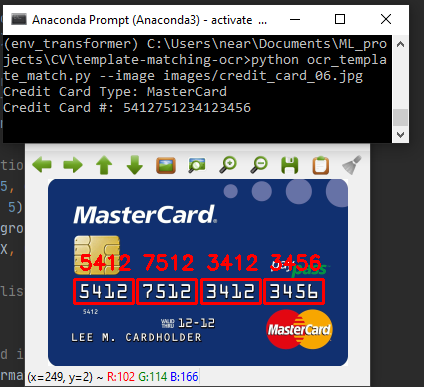

# Credit-card-OCR
Read credit card numbers from picture or high resolution carmera in real time, and also output credit card number and type.

1. Localize the four groupings of four digits on a credit card.
2. Extract each of these four groupings followed by segmenting each of the sixteen numbers individually.
3. Recognize each of the sixteen credit card digits by using template matching and the OCR-A font.

Ang Liu and Jilin Wang
